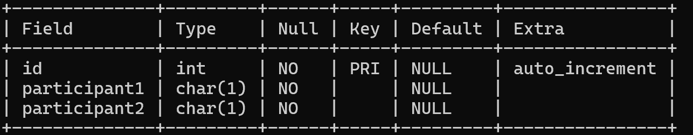
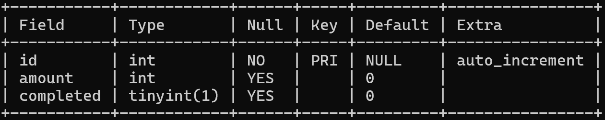
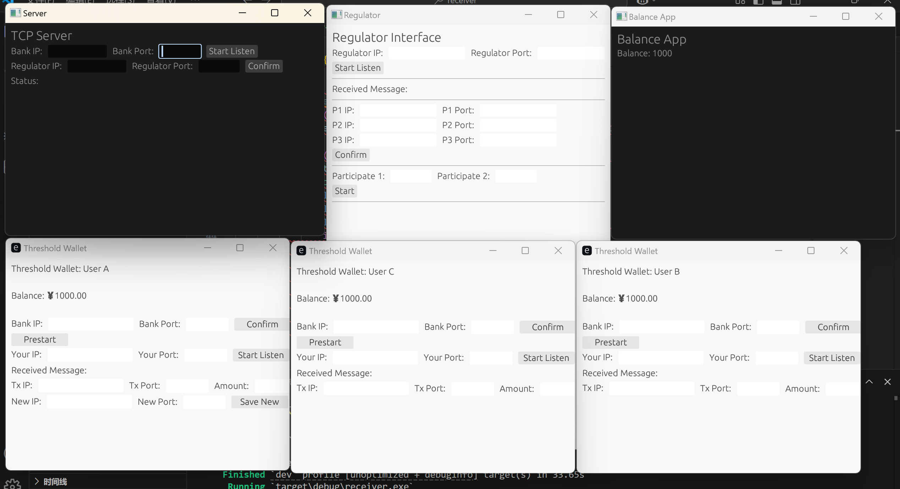
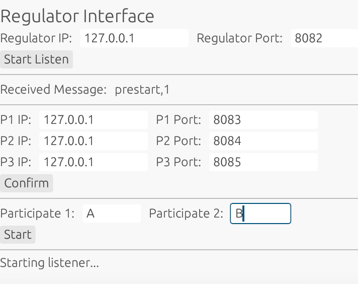

1. 项目说明。
   
   本项目可模拟交易的执行过程，包含六个子项目，分别为bank、regulator、usera、userb、userc和receiver。

   通信使用tcp，可以在每个项目的图形化界面中配置各自的地址，但receiver的地址（127.0.0.1:9091）是在代码中写死的。

   两个user合作以生成门限签名的过程被略去，因为中期测试并不涉及这一部分，具体来说：当监管方指定usera和userb来生成门限签名时，usera直接发送一条"success,amout"消息给userb和bank，表示签名生成成功，在收到这条消息后，bank认为交易完成。

   两个user合作来确实地生成门限签名也是可以的，所有有关门限签名的函数都包含在gg_2018这个文件夹里，该文件夹存在于三个user的代码中，需要什么直接调用即可。调用方式可参考gg_2018/test.rs。

2. 数据库配置。

   bank和regulator分别维护了表"identity"和"transactions"记录交易和揭示参与方。为此，需要配置mysql。

   mysql的地址可直接在bank和regualtor的.env中配置。

   除了mysql地址外，我使用的是：数据库-szrmb，表1-identity，表2-transactions。

   identity数据类型为：

   transactions数据类型为: 
   
3. 运行说明。

   现在运行一遍该项目。tcp配置为：bank-127.0.0.1:8081;regulator-127.0.0.1:8082;usea-127.0.0.1:8083;userb-127.0.0.1:8084;userc-127.0.0.1:8085;receiver-127.0.0.1:9091。
   
（1）在本地分别打开 bank,regulator,receiver,usera,userb,userc 这六个项目，运行src/main.rs中的main函数。打开后界面如下：

（2）配置tcp地址，配置参数如下：

   需要注意的是，在bank中，需要先输入regulator的tcp地址，点击confirm，然后才可以输入自身的地址，再点击start listen以监听该地址。

（3）交易第一步：发起方上报银行，银行再通知监管方。

   假定usra为发起方，在这一步，只需在usera中点击prestart即可。

（4）交易第二步：监管方指定门限签名参与方。

   假定监管方指定usera和userb为参与方，在usera点击prestart后，regulator可在界面中看到"prestart,1"的消息，代表可以指定参与方。
   
   然后regulator在下方输入栏中输入"A"和"B"，再点击start即可。

   需要注意的是，只有出现类似"prestart,1"这样的消息在界面上，start按钮才可点击。并且在点击start按钮后，"prestart,1"即会消失。1代表交易序号。

   

（5）交易第三步：参与方生成门限签名并上报银行。

   在监管方指定了"A"和"B"后，在usera和userb的界面上会分别显示"start,B"和"start,A"，以告知他们另一个参与方是谁，以及可以开始执行交易了。

   usera需要首先在页面上输入userc(不参与交易的user)的地址并点击savenew。

   然后usera输入userb的地址和amout，并点击start。

（6）交易第四步：更新余额。

   在usera点击start后，如果金额符合条件，则会更新所有user和receiver的金额并在界面上显示。

（7）交易第五步：监管方可监管。

   查看szrmb中的transactions表即可。

4. 代码逻辑。

   依照中期测试报告中的逻辑。

5. 尚未完成的。

   （1）软硬件接口。

   该部分主要发生在usera点击start按钮后所发生的事件，只要修改start所绑定的事件处理函数即可。

   理应的做法：usera点击start按钮，usera和userb多轮交互(调用gg_2018中的函数)以生成门限签名，然后将签名交给usera，usera将(message,sig)交给银行。

   现在的做法是：usera点击start按钮，usera将"success,amout"交给银行。

   

   

