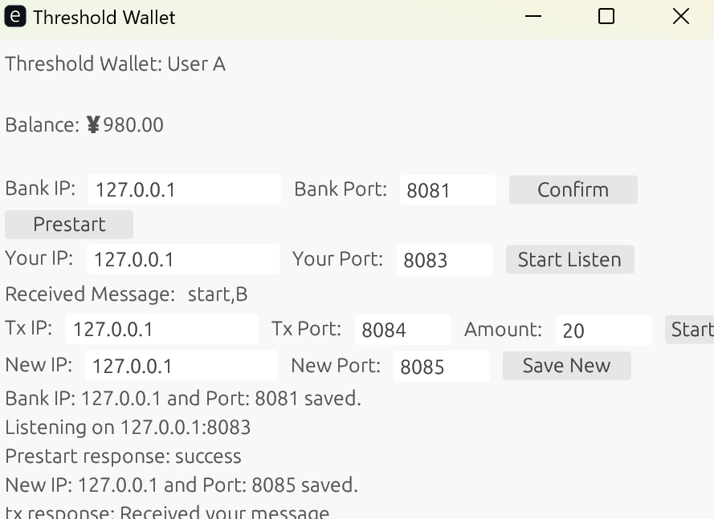

1. 身份说明。
   
   bank：银行

   regulator：监管方

   receiver：接收方

   usera,userb,userc：发送方的用户A、用户B和用户C，他们组成一个（2,3）门限钱包
   
2. 运行说明。
   
（1）在本地分别打开 bank,regulator,receiver,usera,userb,userc 这六个项目。

（2）将bank和regulator中的Mysql数据库配置修改为本地配置。

（3）我代码中的Mysql配置是：数据库-szrmb，表1-identity，表2-transactions。

identity数据类型为：

transactions数据类型为: 

3. 运行示例。

   （1）打开项目，界面如下：

   （2）配置tcp地址，配置结果如下：

   （3）交易发起方A发起交易，上报银行，监管方指定门限签名参与方A和B：

   （4）A和B发起门限签名，并上报银行：

   （5）A、B、C和receiver的余额发生变化。
